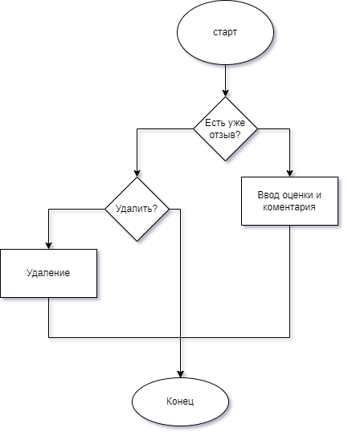
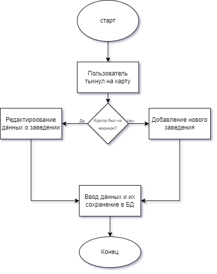

# HTTP аутентификация

## Текст задания
### Цель работы
Спроектировать и разработать систему авторизации пользователей на протоколе HTTP

## Ход работы

1) [Пользовательский интерфейс](https://www.figma.com/file/rAE7J5cg0buD9sJShTWYQM/IS_lr_1?node-id=31%3A2)

2) Пользовательские сценарии работы


3. API сервера и хореография\
   

4. Структура БД

| id | login | email | password |

- id : INT, PRIMARY KEY, AUTO_INCREMENT
  (уникальный идентификатор пользователя)
- login : VARCHAR(250), по умолчанию NULL
  (логин)
- email: VARCHAR(255), по умолчанию NULL
  (почта)
- pass: VARCHAR(500), по умолчанию NULL
  (хешированный пароль)

Таблица: information

| id | name | description | rating | reviews |

-	id: int : id
-	name: text : название заведения
-	description: text : описание заведения
-	rating:	float : рейтинг заведения		
-	reviews: int : количетсво отзывов

Таблица: points 

| id | y | x | owner | 

-	id: int : id
-	y: double : координата заведения
-	x: double : координата заведения
-	owner:	varchar(32) : владелец заведения

Таблица: reviews

| id | username | rating | comment |

-	id:	int	: id		
-	username: varchar(32) : имя пользователя		
-	rating:	int	: оценка пользователя от 1 до 5
-	comment: text : комментарий пользовотеля

Таблица: users

| id | login | type | hash | salt |

-	id: int : id
-	login: varchar(32) : логин
-	type: varchar(8) : тип пользователя (владелец/пользователь)
-	hash: text : хешированный пароль
-	salt: varbinary(16)	: соль


5) Алгоритмы

- Функционал посетителя\

- Функционал владельца\


## Значимые фрагменты кода
- Авторизация
```js
<?php
require_once "../config/connect.php";

$login = $_POST['login'];
$password = $_POST['password'];

$count = mysqli_fetch_row(mysqli_query($connect, "SELECT count(*) FROM `users` WHERE `login` = '$login'"));
if ($count[0] == 0){
    echo "0";
}
else {
    $user = mysqli_fetch_row(mysqli_query($connect, "SELECT * FROM `users` WHERE `login` = '$login'"));
    $type = $user[2];
    $hash = $user[3];
    $salt = $user[4];
    if ($hash == hash('sha256', $password . $salt)) {
        session_start();
        $_SESSION["_".$login] = true;
        echo "$type";
    } else {
        echo "0";
    }
}
    ?>
```
